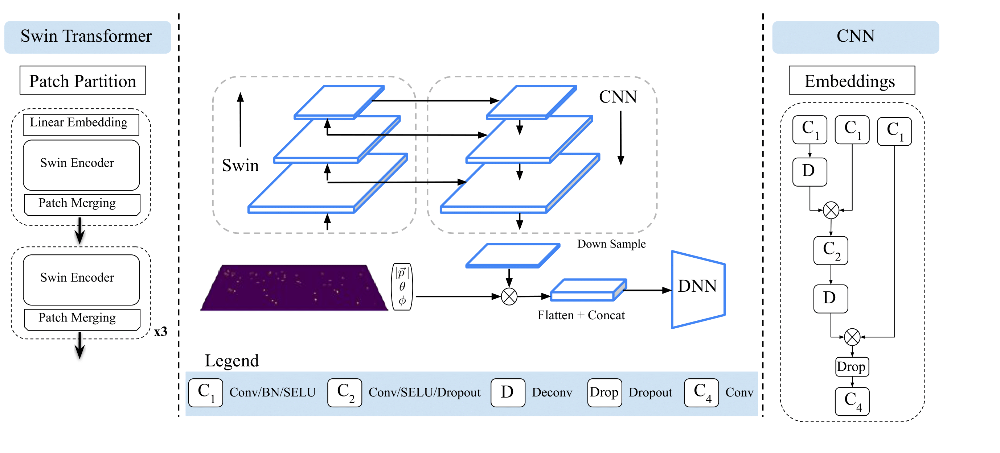
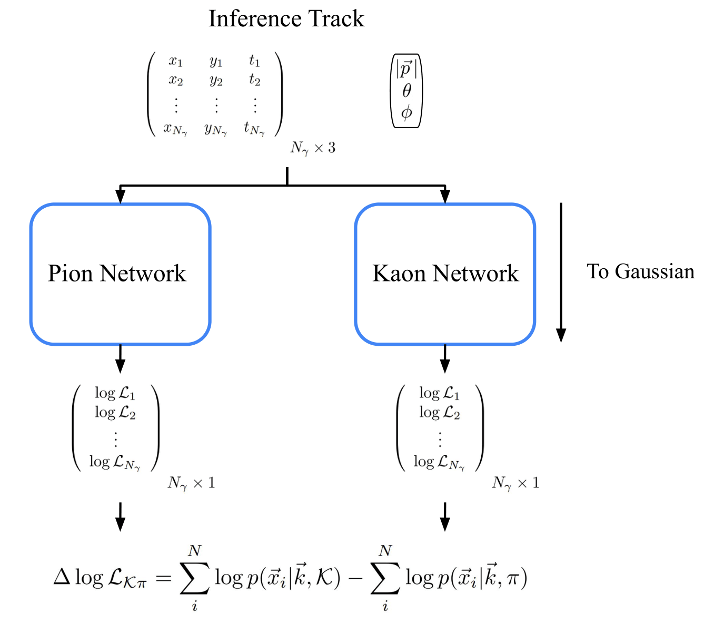

# Deep(er)RICH

## Deeper Reconstruciton of Imaging Cherenkov Detectors

The code base for: arxiv link.

# Abstract 
Imaging Cherenkov detectors are crucial for particle identification (PID) in nuclear and particle physics experiments. Fast reconstruction algorithms are essential for real-time alignment, calibration, data quality control, and speeding up analysis. At the future Electron-Ion Collider (EIC), the ePIC detector will feature a dual Ring Imaging Cherenkov (dual-RICH) detector in the hadron direction, a Detector of Internally Reflected Cherenkov (DIRC) in the barrel, and a proximity focus RICH in the electron direction. This paper focuses on the DIRC detector, which presents complex hit patterns and is also used for PID of pions and kaons in the \gluex experiment at JLab.
%
We present Deep(er)RICH, an extension of the seminal DeepRICH work, offering improved and faster PID compared to traditional methods and, for the first time, fast and accurate simulation. This advancement addresses a major bottleneck in Cherenkov detector simulations involving photon tracking through complex surfaces.
%
Our results leverage advancements in vision Transformers, specifically Swin and normalizing flows. These methods enable direct learning from real data and the reconstruction of complex topologies.
%
We conclude by discussing the implications and future extensions of this work, which can offer capabilties for PID for multiple cutting-edge experiments. 

# Contents
- [Requirements](#Section-1)
- [Dataset Access](#Section-2)
- [Deep(er)RICH](#Section-3)
- [Usage](#Section-4)
    

# Requirements

- Python:     3.11.4
- Pytorch:    2.0.1
- CUDA:       11.7
- [FrEIA](https://github.com/vislearn/FrEIA)
- [NFlows](https://github.com/bayesiains/nflows)
- [ROOT](https://root.cern/install/)

The dependencies for the Fast Simulation models and Transformer can be install using the .yml files in the respective folders.

`$ conda env create -f ptorch.yml`
`$ conda env create -f swin_env.yml`

Note that some packages (such as FrEAI or NFlows) may not install properly. In this case, you can pip install them inside the above environments with the following command to ensure the correct python path is set.

`$ python3 -m pip install <package>`

# Dataset Access

Data is processed within the FastSimulation folder. The output format of simulation produces flat trees that we will process with a C script in ROOT. The output ROOT files from simulation can be merged into a single file, or left as individual smaller files. We will work within the **ROOT_Processing** folder.

- Modify the submit.py script to reflect the path of where you data will be located (/path/to/data/json), and where you want the output .json files to be created. If simulation output is left as invididual files, submit.py will submit jobs for each individual ROOT file and place them in the desired json folder.
 
If you are not using a batch system, you can directly utilize one of **process_all.tcsh** or **process_single.tcsh** to process a folder of files, or a single file. You will need to modify the paths included in these scripts. You may also wish to convert them to bash.

Once data is proccessed with our C script, we will use python to extract data into .pkl files, where each entry in a .pkl file will contain a single track. This can be done using the submit.py file within the **Processing** folder. This will behave in a similar way to the ROOT scripts, submitting invidual jobs for each .json file produced by the previous step. You will need to modify the paths within this .py file to reflect where you have stored the json directory. If you are not using a batch system, you can simply run the file by itself with the following command:

`$ python make_GlueX_data.py --file <filename.json> --base_dir </path/to/file_location>`

You will need to run this command multiple times if you have multiple simulation files / particle types.

You can then modify the paths in the merge_data.py file and use it to merge data in a 70/15/15% train, validation, test split. You can also do this by hand. These .pkl files will be directly used to train the Transformer.

Once this is done, you can use the Make_Data.ipynb notebook to create the datasets needed for Fast Simulation.

# Deep(er)RICH

Deep(er)RICH consists of two PID methods a Vision Transformer, and a Delta Loglikelihood method using the base distributions of normalizing flows. 

In order to use Normalizing Flows, you will need to train two models. One for each particle type ($\pi / K$)

# Usage 

## Training 

Training is configuration file based for both methods. Within each folder you will find the respective configuration files that detail hyperparameter choices, along with path information. You will need to create directories (where you choose) to house the trained models. You will need to update the configuration file (config/<file>.json) to point to this folder, along with where the data files are located.
    
To train the Transformer you can run the following command:
    
`$ python train_swin.py --config config/pgun_config.json --distributed 0`

If you have multiple GPUs you may set --distributed 1 to speed up training. 

This will create a folder within the "output/dir" folder of the config file that will be named based on the "name" field of the config file. The weights at each epoch will be saved here for later use. You can also train the Transformer on Fast Simulated data (provided you have generated it) by modification of the other configuration file provided.

Training of the normalizing flow functions the same manner, although you will need to specify in the config file which of the two PIDs you would like to train on, *i.e.*, "Kaon" or "Pion" within the "method" field.

`$ python train_fs.py --config config/pgun_config.json`
    

## Testing

Create a folder within the Transformer directory called "Figures".
    
Once you have models trained, you can test the Transformer with the following command:
    
`$ python run_inference.py --config config/pgun_config.json --trained_as_distributed 0`

Note that if you have trained on multiple GPUs you will need to set the last flag to 1 in order to correctly load the model. Inference is performed only using a single GPU.

Create a folder within the FastSimulation folder called "Inference".
To evaluate the PID performance of the Normalizing Flow based method, you can use the following command:

`$ python run_DLL.py --config config/pgun_config.json`

## Fast Simulation
    
Createa a folder called "Figures" within the FastSimulation folder.
    
You can generate plots for both Kaons and Pions using the following command:
    
`python generate_plots.py --config config/pgun_config.json`
    
Note that you can change which particle is generated by changing the "method" field of the config file to either "Pion" or "Kaon". This will correctly point the script to the trained model for that particle.
    
The script will produce plots for segmented regions along each DIRC bar.
    
.png)
    
.png)

You can generate artificial datasets with the following command:

`python generate_dataset.py --config config/pgun_config.json --n_datasets 1`

The --n_datasets will correspond to how many times you want to artificially generate the statistics used for training/validation/testing. You can then modify the other config file provided in the Transformer folder to train on Fast Simulated data. Note that the "nf_generated" field of the config file must be set accordingly.

You will also need to merge these datasets either by hand or using the merge_data.py file in the **Processing** folder. If done by hand, ensure that you shuffle the data being that we generate in bins of momentum.
